# Ahmad Farrel Aly
# 09011282328045
# SK3C
# Praktikum Sistem Operasi

1. Lihat daftar secara lengkap pada direktori aktif, belokkan tampilan standard output ke filebaru. 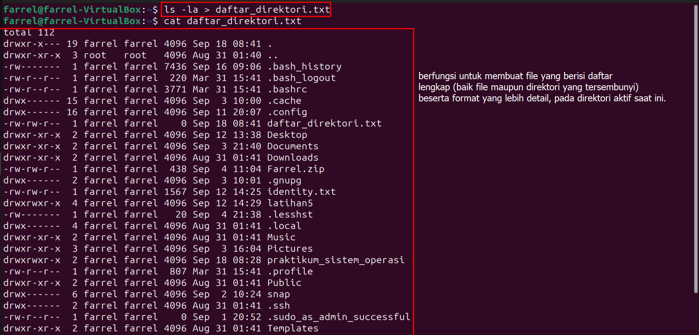
2. Lihat daftar secara lengkap pada direktori /etc/paswd, belokkan tampilan standard output ke file baru tanpa menghapus file baru sebelumnya. 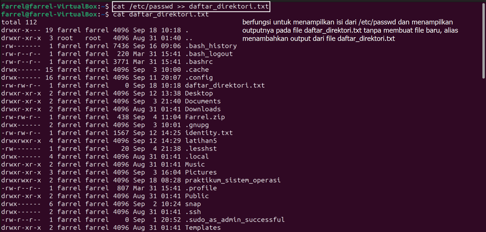 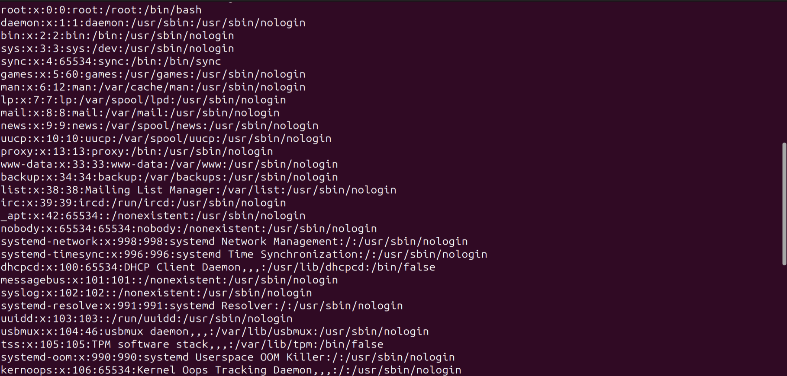
3. Urutkan file baru dengan cara membelokkan standard input 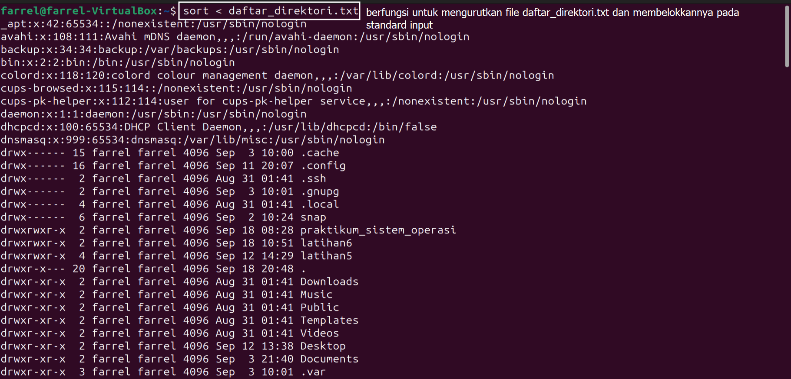
4. Urutkan file baru dengan cara membelokkan standard input dan standard output ke file baru.urut. 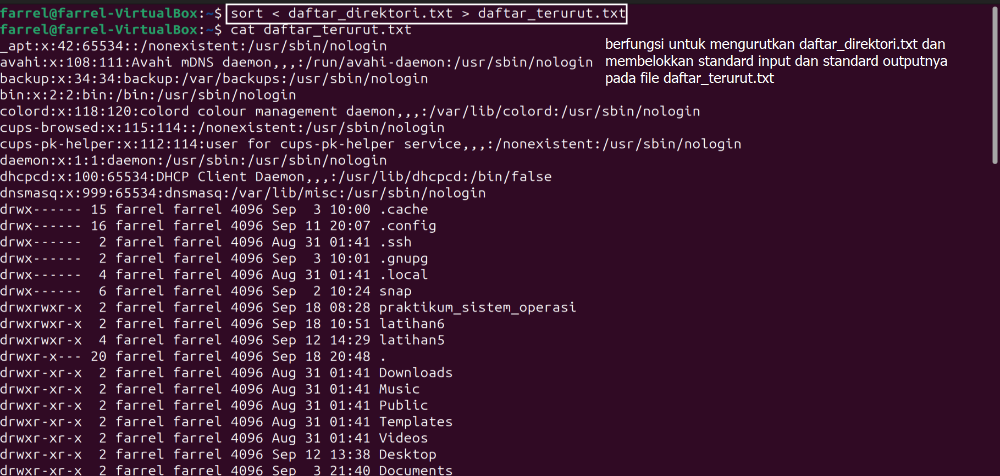
5. Buatlah direktori latihan6 sebanyak 2 kali dan belokkan standard error ke file rmdirerror.txt. 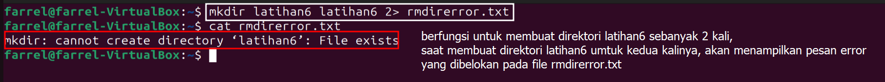
6. Urutkan kalimat berikut :
Jakarta
Bandung
Surabaya
Padang
Palembang
Lampung
Dengan menggunakan notasi here document (<@@@ …@@@) 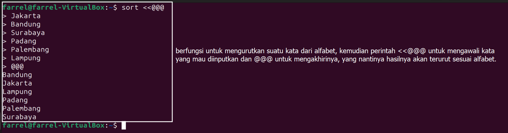
7. Hitung jumlah baris, kata dan karakter dari file baru.urut dengan menggunakan filter dan tambahkan data tersebut ke file baru. 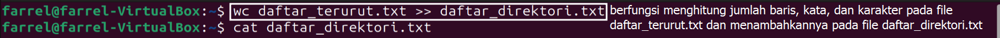 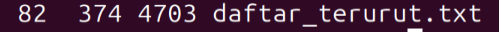
8. Gunakan perintah di bawah ini dan perhatikan hasilnya.
$ cat /etc/passwd | sort | pr –n | grep tty03
$ find /etc –print | head
$ head /etc/passwd | tail –5 | sort
 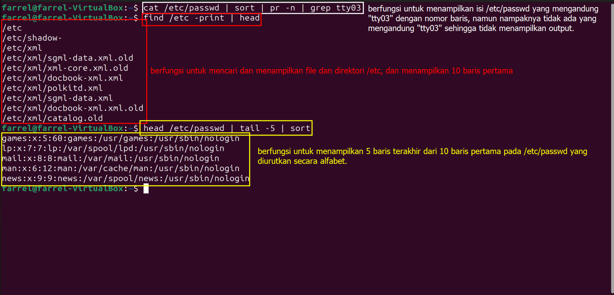
9. Gunakan perintah $ who | cat | cat | sort | pr | head | cat | tail dan perhatikan hasilnya. 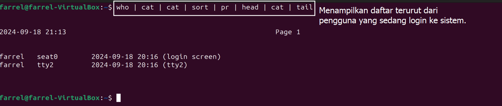
